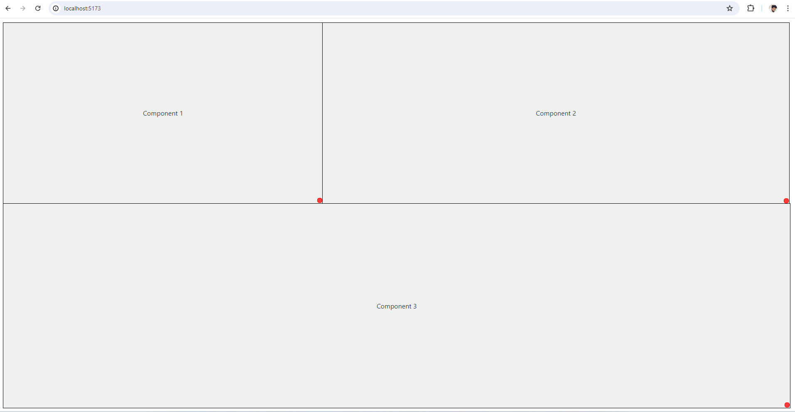

# React Resizable Components

This project demonstrates a responsive layout with resizable components using React and `react-resizable`. Users can resize the components by dragging them from any side, and neighboring components will adjust accordingly.

## Features

- Resizable components with adjustable width and height.
- Neighboring components expand or shrink based on the resizing operations.
- Responsive layout for all laptop devices.
- Custom resize handles for a better user experience.

## Screenshot



## Installation

1. Clone the repository:
   ```sh
   git clone https://github.com/your-username/react-resizable-components.git
   cd react-resizable-components
